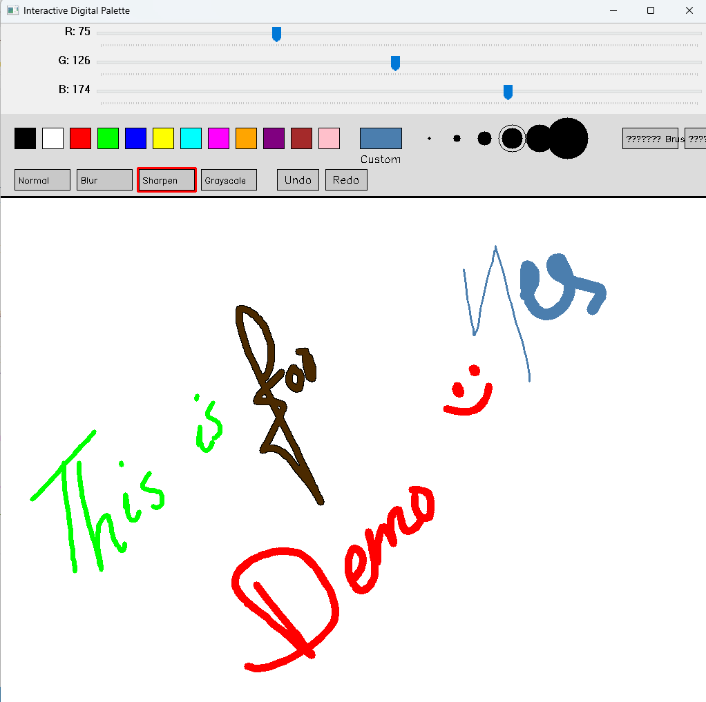

# Interactive Digital Palette & Drawing Tool 🖌️

Welcome to the **Interactive Digital Palette & Drawing Tool** — a fun and powerful desktop drawing application built using **Python** and **OpenCV**! This tool transforms your screen into a virtual canvas, letting you sketch, paint, erase, and apply effects just like a real digital artist! 🧑‍🎨🖼️

---

## 🚀 Features

✨ **Color Palette**
Choose from a rich palette of predefined colors or create your own using RGB sliders.

🖌️ **Tools**

* Brush (with adjustable sizes)
* Eraser
* Clear Canvas 🗑️
* Save Artwork 💾

🎨 **Custom Color Mixer**
Adjust RGB sliders to create any custom color you desire!

🧠 **Image Effects**

* Normal
* Blur 🔍
* Sharpen ✨
* Grayscale 🖤

↩️ **Undo/Redo** Support
Go back and forth through your drawing history easily.

🖼️ **Save Your Masterpiece**
Export your artwork as a PNG file with a timestamped filename.

---

## 🛠️ How to Use

1. **Run the app**:

   ```bash
   python "Interactive Digital Palette & Drawing Tool.py"
   ```

2. **Controls**:

   * Click to select colors, brushes, tools, or apply effects
   * Press `Z` to Undo, `Y` to Redo
   * Press `C` to Clear the canvas
   * Press `S` to Save your artwork
   * Press `ESC` to exit

---

## 📦 Requirements

* Python 3.x
* OpenCV (`cv2`)
* NumPy

Install dependencies:

```bash
pip install opencv-python numpy
```

---

## 🧠 Ideal For:

* Beginners learning Python & OpenCV
* Kids exploring digital art
* Anyone wanting a fun sketchpad on their computer!

---

## 📸 Preview

> This tool opens a window where you can draw freely using your mouse with intuitive controls and a clean interface.


---